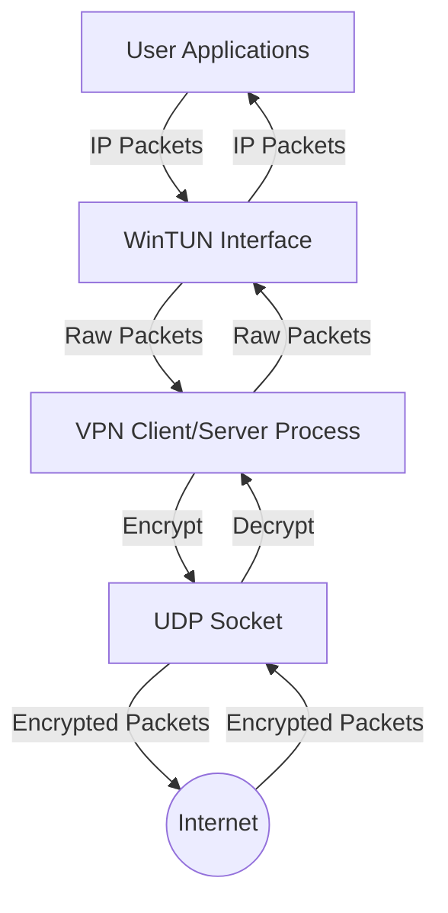
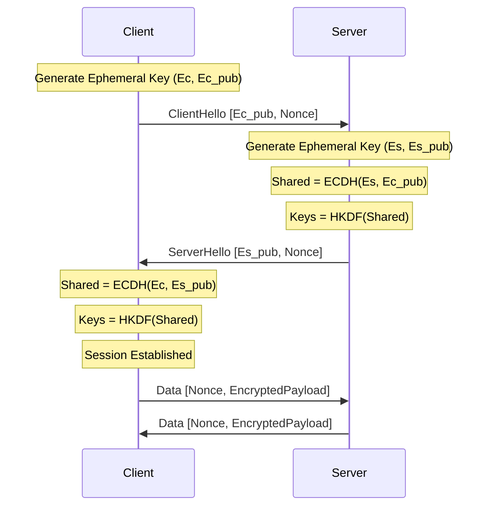

# System Architecture

## High-Level Overview

## Protocol State Machine

## Packet Formats

### ClientHello / ServerHello
| Field | Size | Description |
|-------|------|-------------|
| Type | 1 | 0x01 (Client) / 0x02 (Server) |
| PubKey| 32 | X25519 Public Key |
| Nonce | 12 | Random Nonce |

### Data Packet
| Field | Size | Description |
|-------|------|-------------|
| Type | 1 | 0x03 (Data) |
| Nonce | 12 | Packet Nonce (Counter) |
| Payload| N | Encrypted IP Packet + Tag (16 bytes) |
